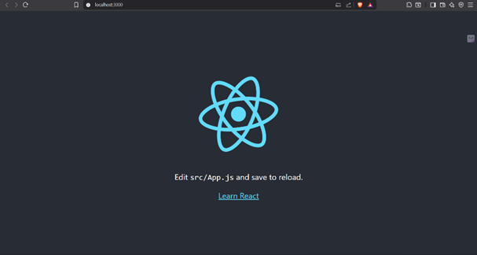
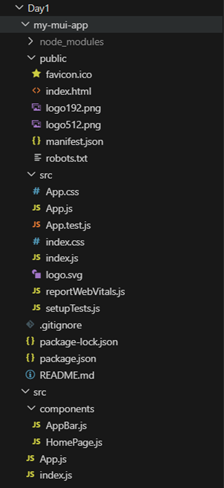

# 📝 Week2 Day1— [Sep29]

## Task
- Scaffold app
- setup basic folder structure 
- Create homepage with MUI Typography and AppBar

## Assets




## Steps Followed

- 	The scaffold app meaning a basic foundation structure for the development of any project.
-	Here it was to be built with react and vite.
-	So the folder structure is as shown in the above picture
-	Installed the frameworks for react app
-	Here the my-mui-app contains all the node modules and components
-	For this first I  created a react app named my-mui-app using the command:
```
	npx create-react-app my-mui-app
```
-	And then set the current directory to my-mui-app
-	Installed the material ui and components and also the node modules using the command:
```
	npm install @mui/material @emotion/react @emotion/styled
```
-	Then to start the react app at the localhost I used the command:
```
	npm start
```
-	To test the development server:
```	
    npm test
```
-	The basic code was provided in https://react.dev/learn and referred Gen ai sources.
-	I am thinking of adding content for the home page to have it started.
-	Once the local host is started I can save changes and check for result.
