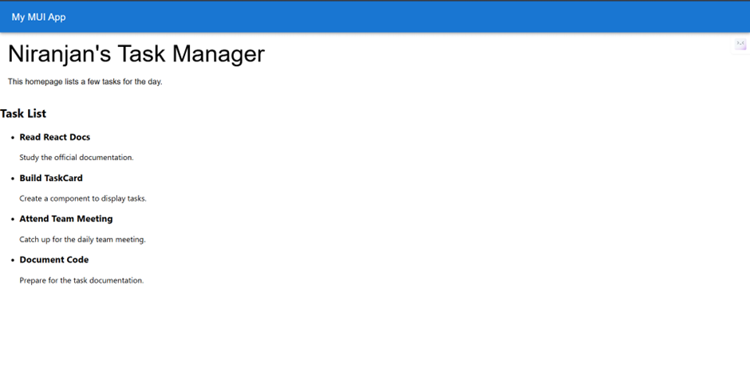
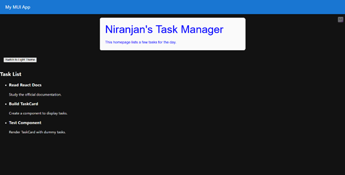
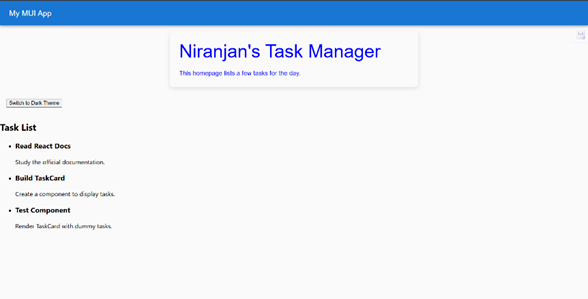

# 📝 Week2 Day2— [Sep30]

## Task
- TaskCard component
- Render list of dummy tasks via props

## Assets

## Steps Followed

- 	Used the scaffold from yesterday’s task
-	Added A new file TaskCard.tsx which consists of dummy data 
-	Demo sample includes daily tasks
-	Used props to pass data from the App to TaskCard.
-	App.tsx contains import routes and a default function
-	Could improve css part that is now we can have css within the same file
-	Added a button to switch between light and dark theme.
