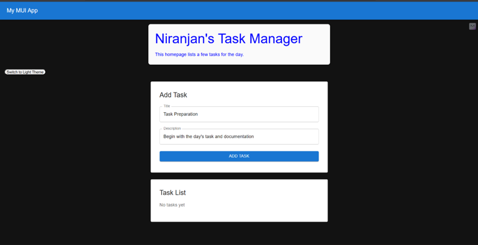
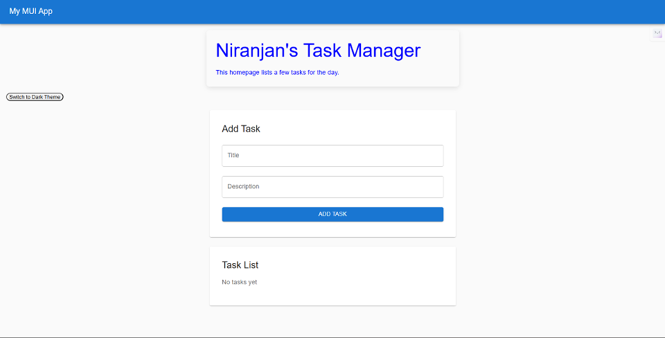

# 📝 Week2 Day3— [Oct1]

## Task
- Add ability to add tasks 
- Manage state; fetch effects if needed (dummy)
- Create form using MUI TextFields and Buttons
- Validate required inputs / length / number etc.
## Gallery

## Steps Followed
-	Created a new page TaskForm.jsx for the section to add tasks
-	Removed the demo values
-	The fields check for the criteria for the task input
-	Used onChange and onSubmit to check for input criteria
-	Prevented reload using preventDefault()
-	Added a border radius to make the button a bit  rounded 
-	Further I am thinking to add a popup for errors instead of just displaying them in the input field itself.
