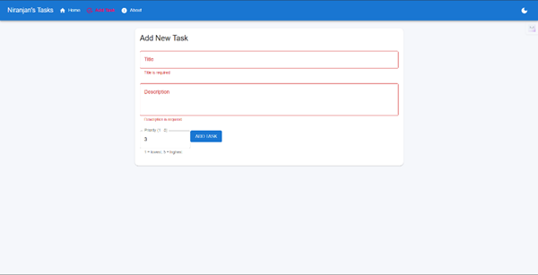
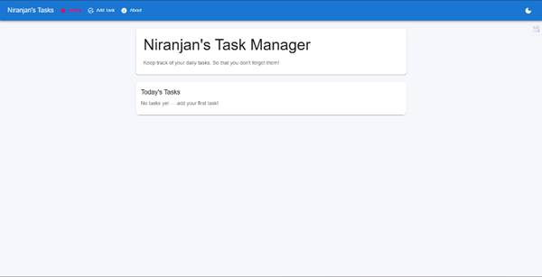
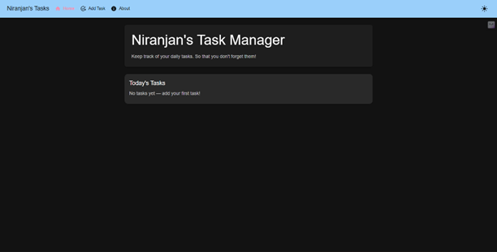
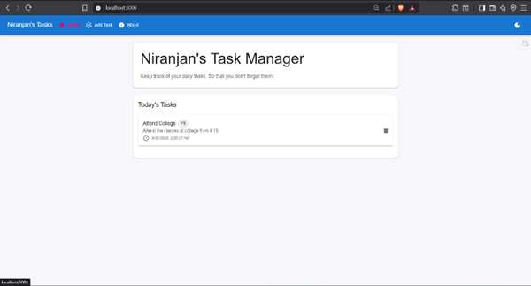

# 📝 Week2 Day3— [Oct1]

## Task
- Add ability to add tasks 
- Manage state; fetch effects if needed (dummy)
- Create form using MUI TextFields and Buttons
- Validate required inputs / length / number etc.
## Gallery

## Steps Followed

-	Added a navbar for navigation around pages
-	Added icons for each button
-	Added a separate page for adding tasks
-	A priority can be set for each task
-	Task can be deleted and stored
-	The task entered is stored locally and loaded on mount
-	The ui is a bit polished with hover effects and buttons
-	A toggle between dark and light theme is available

