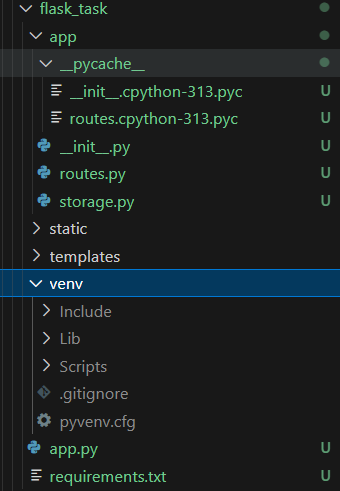
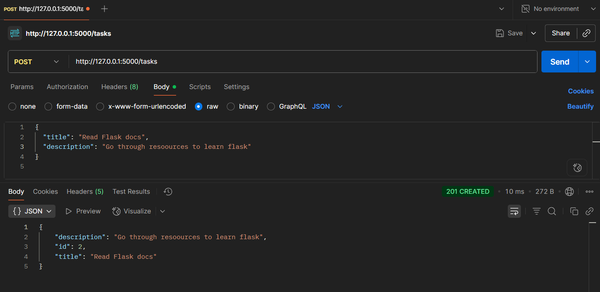

# 📝 Week3 Day1— [Oct6]

---

## Learning Topics
- Python basics
- Flask setup
- Project structure
- REST endpoints: GET, POST
## Task
- Setup Flask project
- Define folder structure (app folder, routes, static etc.)
- Basic “Hello world” route
- Implement GET /tasks and POST /tasks with dummy in‑memory storage
- Test via Postman or curl


---

## Steps Followed

-   Setup the basic files and folder structure
```
flask_tasks/
│
├── app/
│   ├── __init__.py       
│   ├── routes.py         
│   └── storage.py        
│
├── static/                
├── templates/            
│
├── venv/                 
├── run.py                 
└── requirements.txt      
```
-	In the terminal create and initialize venv using
```
python -m venv venv
```
-	Activate venv using
```
venv\Scripts\activate
```
-	Then install flask
```
pip install flask
```
-	Freeze the requirements initially
```
pip freeze > requirements.txt
```
-	Add required roots, and a app file 
-	To launch the dev server
```
python app.py
```
-   The dev server runs at 
```
URL: http://127.0.0.1:5000/
```
-	Test with Postman
-   Provide required data for fields 
-   Perform GET and POST operations 
-   Check for responses and overall functionality

## Gallery






### Niranjan C N