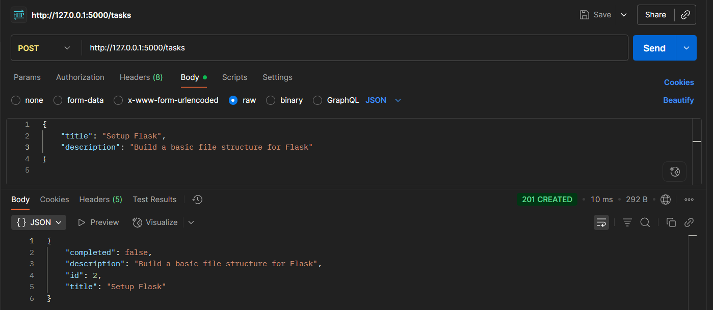
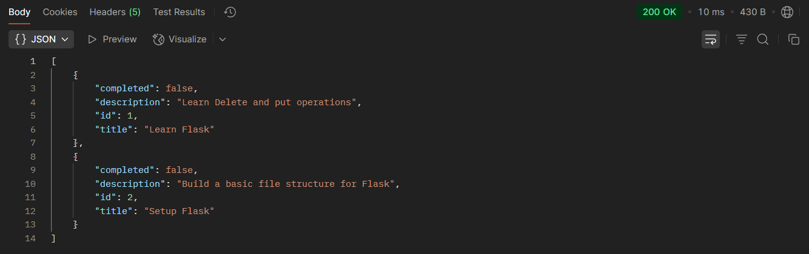
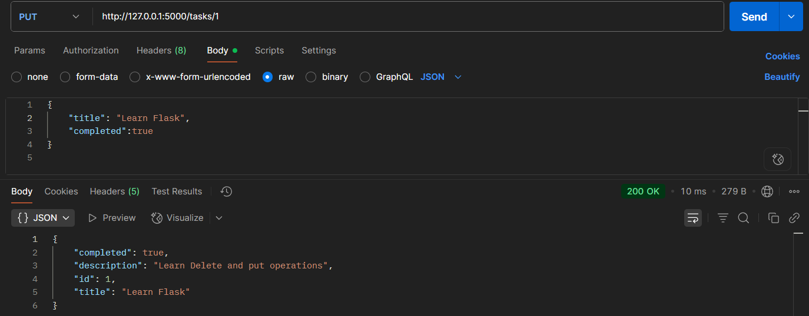
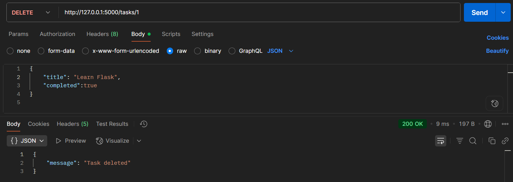

# 📝 Week3 Day1— [Oct6]

---

## Learning Topics
- PUT / DELETE
- Parameter passing
- Path vs query params
## Task
- Add endpoints: DELETE /tasks/<id>, PUT /tasks/<id>
- Optional filtering via query ‑ e.g. ?completed=true

## Gallery






---

## Steps Followed

-   Run the FLask app using 
```
Python app.py
```
-	Perform POST to add tasks in POSTMAN
-   Perform GET to get alist of added tasks
-   Perform PUT to update a particular task 
-   Perform DELETE to delete a particular task
-   Access tasks through IDs for example:
```
http://127.0.0.1:5000/tasks/1
```
- Optional filtering via a query is implemented which here is task completion