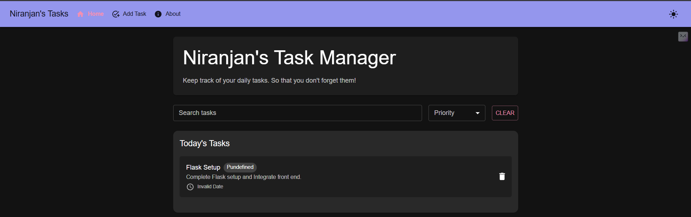
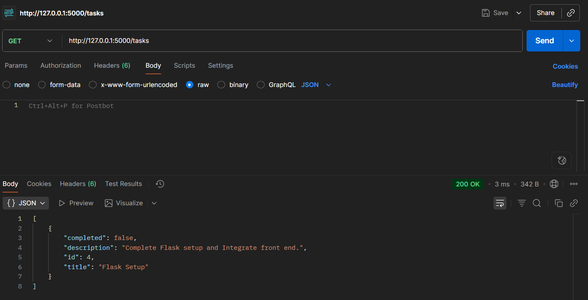
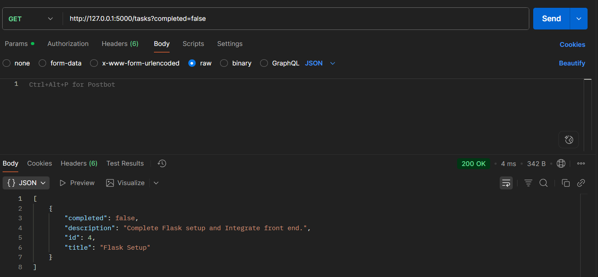
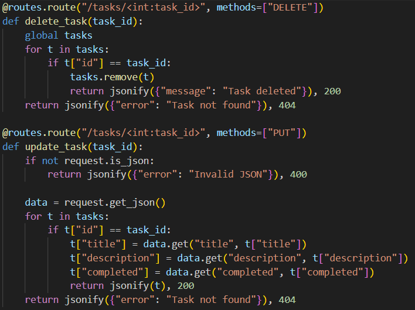

# 📝 Week3 Day3— [Oct9]

---

## Learning Topics
- Error handling
- Input validation
- Status codes 
- CORS 
- Connecting with frontend
- Testing endpoints

## Task
- Add error handlers (404, 400) 
- Validate inputs (e.g. non‑empty strings, valid JSON)
- Ena1ble CORS
- From React frontend make calls
- Test from Postman / browser


## Steps Followed


-	Added error handlers in FLask
-   Validate inputs in routes
-   Installed CORS:
```
pip install flask-cors
```
-   Imported CORS
-   Added fetch function and mentioned 
```
fetch("http://127.0.0.1:5000/tasks")
```
-   Run the FLask app using 
```
Python app.py
```
- Also launch React App:
```
npm start
```
-   Check for responses and errors in postman or browser
-   Perform GET,POST,PUT,DELETE and
-   Check if they are reflecting in both Postman and React app
-   Now React retains data even after refresh as Flash manages it
## Gallery






---
### Niranjan C N