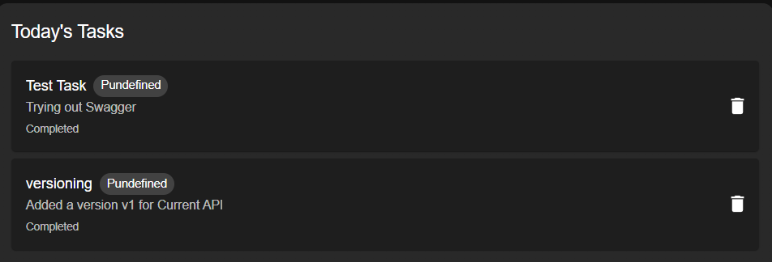
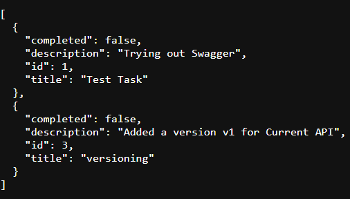
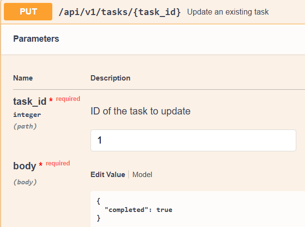
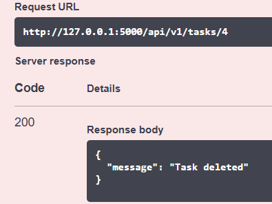

# 📝 Week3 Day4— [Oct10]

---

## Learning Topics
-	Documentation & deployment to dev
-	Versioning API

## Task
-	Write docs (Markdown or OpenAPI)
-	Version the API (e.g. v1)
-	Test deployment locally


## Steps Followed

-   Created a version blueprint 
```
api_v1 = Blueprint("api_v1", __name__, url_prefix="/api/v1")
CORS(api_v1)
```
-	Moved all routes (GET, POST, PUT, DELETE) under /api/v1/tasks. For example:
```
@api_v1.route("/", methods=["GET"])
def home():
```
-   Updated the route import to api_v1 in the app routes:
```
from app.routes import api_v1
app.register_blueprint(api_v1)
```
-   For swagger installation:
```
pip install flasgger

```
Added configs for app.py:
```
swagger = Swagger(app, config=swagger_config, template=swagger_template)
```
-   Added parameters and responses for each route in routes.py
-   Run the backend and check Swagger ui under:
```
http://127.0.0.1:5000/apidocs
```
-   Test routes using GET,PUT,POST and DELETE
-   Tested deployment locally b cheking if updatesare consistent in Swagger,Postman and React app

---

## Gallery






---
### Niranjan C N