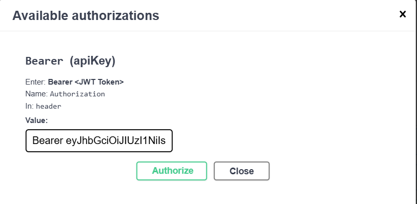
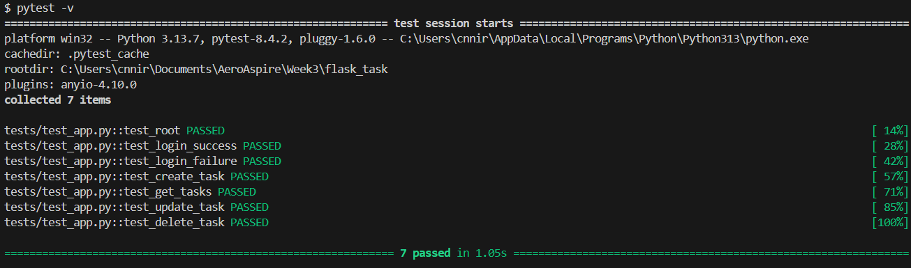
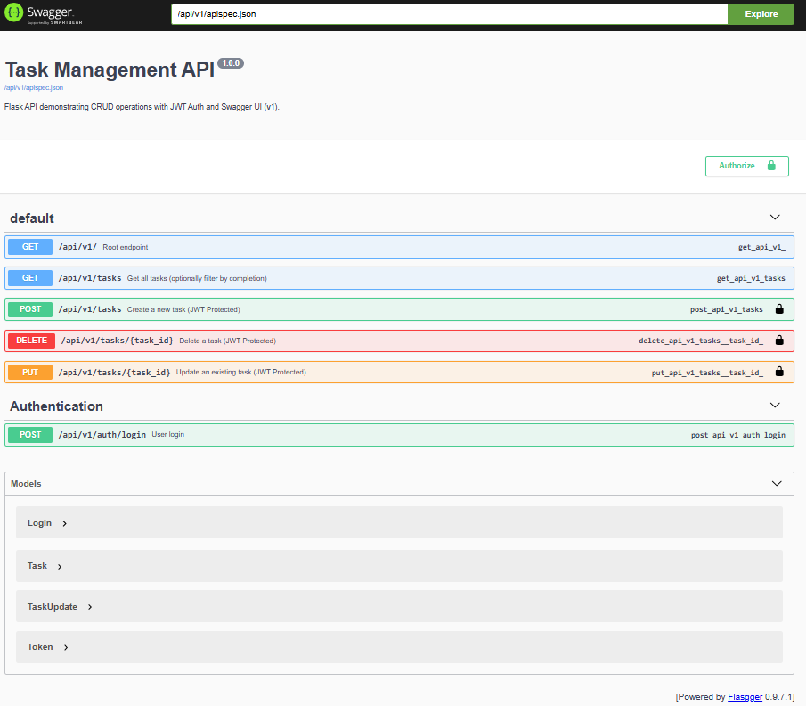
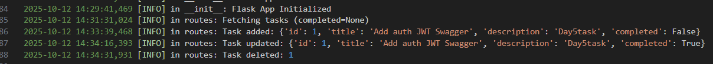

# 📝 Week3 Day5— [Oct11]

---

## Task
-	Authentication (token-based)
-   Logging
-   Testing (unit tests)


## Steps Followed

-   Created 2 files auth.py and test-app.py
-   Installed JWT:
```
pip install Flask-JWT-Extended
```
-   Run the flask app:
```
python run.py
```

-   Test endpoints using Swagger/Postman
-   Login through:
```
POST /api/v1/auth/login 
```
Use token in Authorization: Bearer <token> to acces the authorized PUT,DELETE,POST endpoints

-   Run unit tests:

pytest -v

---

## Challenges:
-   Testing all endpoints with swagger
-   The login part acces token, post method and authorize was difficult to work with 
-   Understanding system log
-   The pytest return with errors which was not clear for me undesrstand
---
## Gallery






---
### Niranjan C N