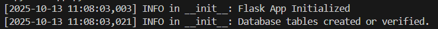
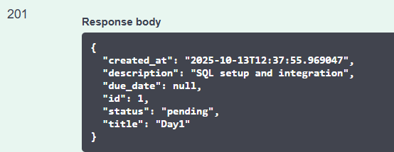
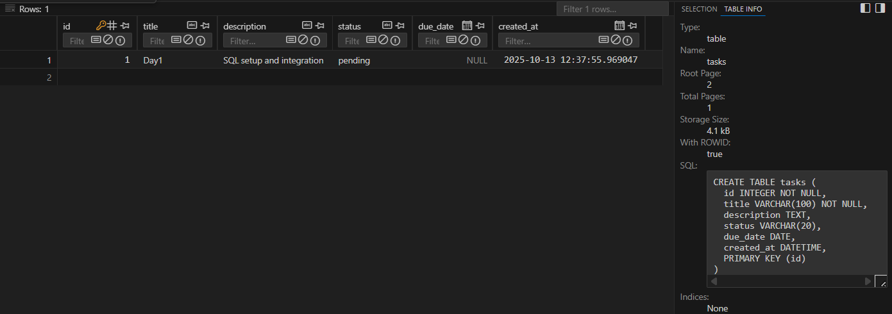
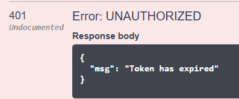

# 📝 Week4 Day1— [Oct13]

---

## Learning Topics:
-   SQL basics: tables, relations, schema design
## Task
-	Design schema for tasks: fields such as id, title, description, status, due_date
-   Create tables

## Steps Followed

-   Install SQL Alchemy
```
pip install flask_sqlalchemy

```
-   Connected Flask app to SQLite
-   Added models and instance folder
-   Created DB (tasks.db)
-   Added a database URI in init
-   Added docs for each method in routes
-   Defined Task model with fields (id, title, description, status, due_date, created_at)
-   Login and collected token
-   Authorize
-   Tested all endpoints 
-   Tested GET method which initiall returns 
```
{
  "items": [],
  "page": 2,
  "pages": 0,
  "per_page": 5,
  "total": 0
}

```
-   Then later upon POST and GET
```
{
  "items": [
    {
      "created_at": "2025-10-13T12:37:55.969047",
      "description": "SQL setup and integration",
      "due_date": null,
      "id": 1,
      "status": "pending",
      "title": "Day1"
    }
  ],
  "page": 1,
  "pages": 1,
  "per_page": 20,
  "total": 1
}
```
-   Installed VScode extension SQLite Viewer for seeing tasks.db


---

## Challenges:
-   JWT sessions and token expiry
-   Connection issues: Config path in init
-   Pycache missed in gitignore and push issues
-   “Not Found” error on root URL
-   Swagger retured only POST-login method(missed auth required methods)

## Gallery






---
### Niranjan C N