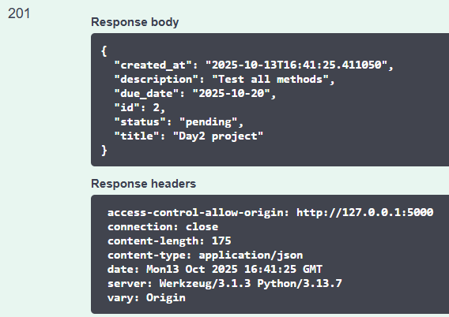
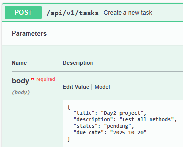
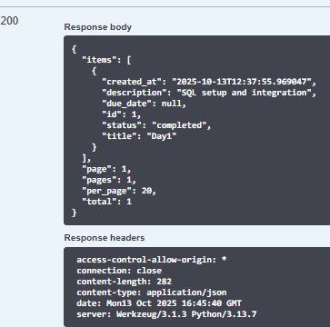
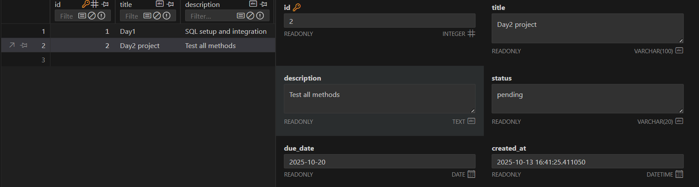

# 📝 Week4 Day2— [Oct14]

---

## Learning Topics:
-   DB integration 
-   ORM vs direct SQL
## Task
-	Connect Flask to SQLite or MySQL
-   Implement CRUD using raw SQL or ORM (SQLAlchemy)

## Steps Followed

-   Defined Task model with fields (id, title, description, status, due_date, created_at)
-   Login and collected token
-   Authorize
-   Tested all endpoints 
-   POST 
```
{
  "created_at": "2025-10-13T16:41:25.411050",
  "description": "Test all methods",
  "due_date": "2025-10-20",
  "id": 2,
  "status": "pending",
  "title": "Day2 project"
}
```
-   PUT
```
{
  "created_at": "2025-10-13T16:41:25.411050",
  "description": "Test all methods",
  "due_date": "2025-10-20",
  "id": 2,
  "status": "completed",
  "title": "Day2 project"
}
```
-   GET
```
{
  "items": [
    {
      "created_at": "2025-10-13T16:41:25.411050",
      "description": "Test all methods",
      "due_date": "2025-10-20",
      "id": 2,
      "status": "pending",
      "title": "Day2 project"
    },
    {
      "created_at": "2025-10-13T12:37:55.969047",
      "description": "SQL setup and integration",
      "due_date": null,
      "id": 1,
      "status": "completed",
      "title": "Day1"
    }
  ],
  "page": 1,
  "pages": 1,
  "per_page": 20,
  "total": 2
}
```
---

## Gallery






---
### Niranjan C N