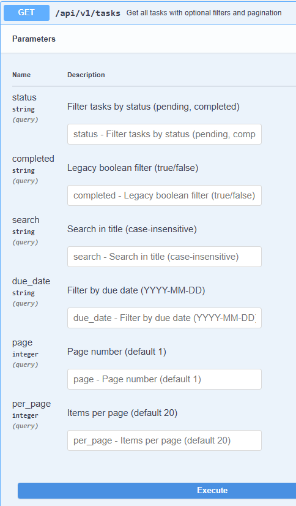
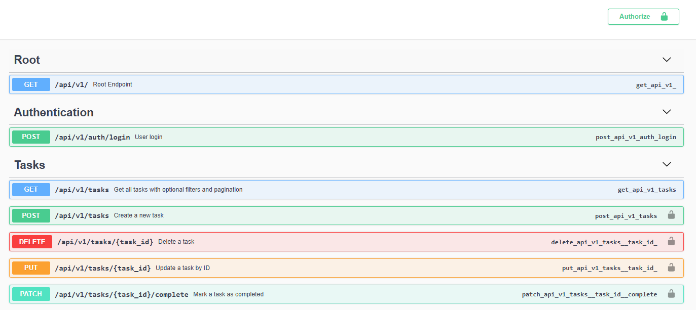
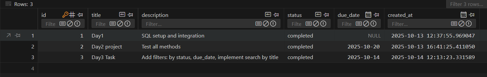
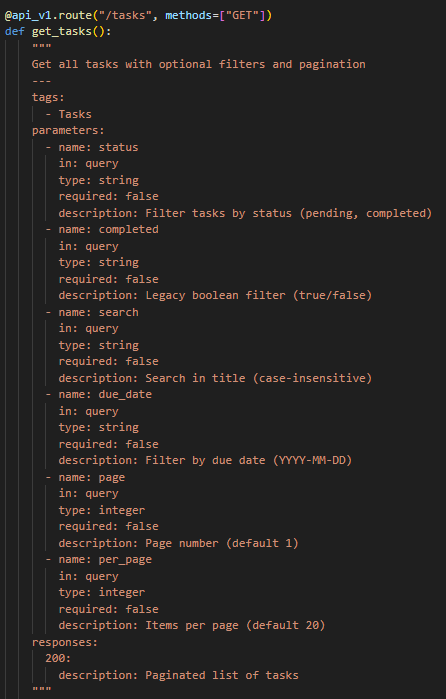

# 📝 Week4 Day3— [Oct15]

---

## Learning Topics:
-   Filtering / search
-   Query parameters
-   Indexing basics
## Task
-	Add filters: by status, due_date
-   Implement search by title
-   Possibly pagination basics

## Steps Followed

-   Updated Docstrings with fields(id, title, description, status, due_date, created_at)
-   Login and collected token
-   Authorize
-   Tested all endpoints 
-   Filters, Search, Pagination
-   Filters: by status and due_date. 
-   Search: by title. 
-   Pagination: page & per_page with limits.
-   POST 
```
body:
{
  "description": "Add filters: by status, due_date, implement search by title",
  "due_date": "2025-10-14",
  "status": "completed",
  "title": "Day3 Task"
}
response:
{
  "created_at": "2025-10-14T12:13:23.331589",
  "description": "Add filters: by status, due_date, implement search by title",
  "due_date": "2025-10-14",
  "id": 3,
  "status": "completed",
  "title": "Day3 Task"
}
```
-   PUT
```
task id = 1
body:
{
  "status": "completed"
}
response:
{
  "created_at": "2025-10-14T12:13:23.331589",
  "description": "Add filters: by status, due_date, implement search by title",
  "due_date": "2025-10-14",
  "id": 3,
  "status": "completed",
  "title": "Day3 Task"
}
```
-   GET
```
Filters:
completed:true
response
{
  "items": [
    {
      "created_at": "2025-10-14T12:13:23.331589",
      "description": "Add filters: by status, due_date, implement search by title",
      "due_date": "2025-10-14",
      "id": 3,
      "status": "completed",
      "title": "Day3 Task"
    },
    {
      "created_at": "2025-10-13T16:41:25.411050",
      "description": "Test all methods",
      "due_date": "2025-10-20",
      "id": 2,
      "status": "completed",
      "title": "Day2 project"
    },
    {
      "created_at": "2025-10-13T12:37:55.969047",
      "description": "SQL setup and integration",
      "due_date": null,
      "id": 1,
      "status": "completed",
      "title": "Day1"
    }
  ],
  "page": 1,
  "pages": 1,
  "per_page": 20,
  "total": 3
}
```
---

## Gallery






---
### Niranjan C N