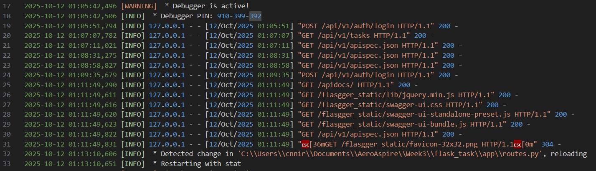
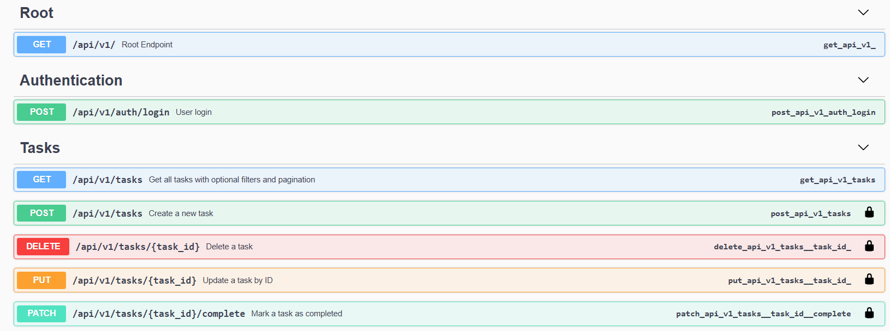

# 📝 Week4 Day4— [Oct16]

---

## Learning Topics:
-   Filtering / search
-   Query parameters
-   Indexing basics
## Task
-	Add filters: by status, due_date
-   Implement search by title
-   Possibly pagination basics

## Steps Followed

-   Implement CRUD operations
-   Istalled migrate package
```
pip install flask-migrate
```
-   Added imports for migrate
-   Initialized migrations directory:
```
flask db init
```
-   Created migration script:
```
flask db migrate -m "Initial migration"
```
-   Applied migration to DB:
```
flask db upgrade
```
-   Seeding 
-   Added a file seed.py in root 
-   Run command for seeding
```
python scripts/seed_db.py
``` 
-   Updated requirements file
-   Enabled flask migration:
```
from flask_migrate import Migrate
```
-   Test run to check values:
```
python seed.py
```
-   Checked consitancy between db and swagger
---

## Gallery




## Challenges:
-   Handling no data error
-   Methods misfunction through pagenation
-   Initially backend returned just array, React expected array but API later returned items

---
### Niranjan C N