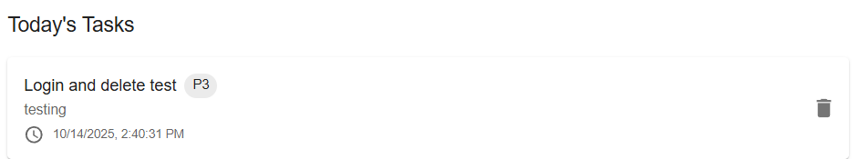
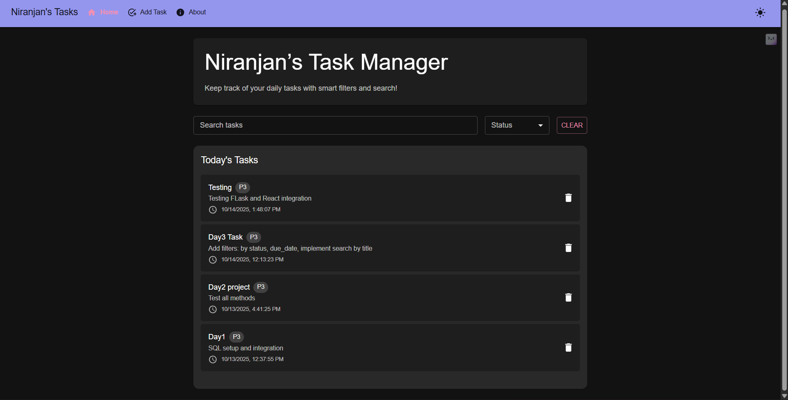
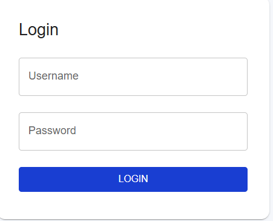
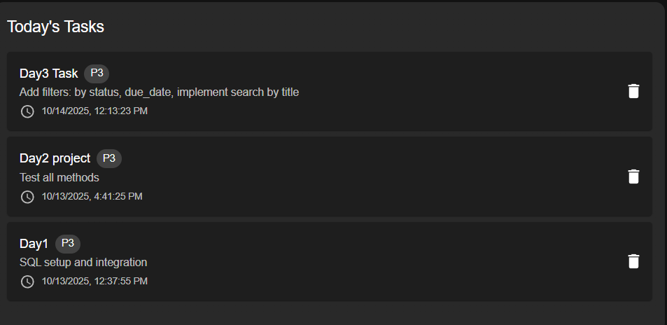

# 📝 Week4 Day3— [Oct15]

---

## Learning Topics:
-   Filtering / search
-   Query parameters
-   Indexing basics
## Task
-	Add filters: by status, due_date
-   Implement search by title
-   Possibly pagination basics

## Steps Followed

-   Login and collected token
-   Authorize
-   Tested all endpoints 
-   Added login for frontend to access protected methods
-   Passed JWT acces token as header
-   Installed axios 
```
npm install axios
```
-   Added a base url in React:
```
const API_BASE = "http://localhost:5000/api/v1";
```
-   Fetched tasks with fetch(API_BASE + "/tasks").
-   Updated React state to use setTasks(data.items) instead of setTasks(data)
- post
```
body
{
  "description": "Testing FLask and React integration",
  "due_date": "2025-10-17",
  "status": "string",
  "title": "Testing"
}
response
{
  "created_at": "2025-10-14T13:48:07.188062",
  "description": "Testing FLask and React integration",
  "due_date": "2025-10-17",
  "id": 4,
  "status": "string",
  "title": "Testing"
}
```
-   This was a sample for post
-   Handler for no task also done with a message reponse, error code
---

## Gallery




- after delete<br>


---
## Challenges
-   Understanding token expiry 
-   How to acces private methods for tasks
### Niranjan C N
